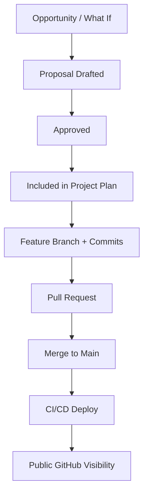

# 🔄 SandlotWizard Change Lifecycle Standard

## ⚠ Canonical Enforcement Notice
This document defines a **canonical standard**.  
All instructions and structures herein must be followed without deviation by developers and AI agents.

---

## 📘 Purpose
To define a traceable and repeatable process for implementing change within the SandlotWizard ecosystem, combining architecture-first governance with Git-based delivery mechanics and GitHub project visibility.

---

## 🗂 Scope
Applies to all code, documentation, and process changes driven by internal proposals or improvement opportunities. Public-facing GitHub activity is reflected through feature branches, pull requests, and project management boards.

---

## 🔁 Lifecycle Phases

```
[Idea] → [Proposal] → [Approval] → [Project Inclusion] → [Branch & Commits] → [Pull Request] → [Merge] → [Deploy] → [Public Signal]
```

### 🔹 1. Idea (Opportunity for Improvement)
- Captured in: `900-ContinualImprovement/OpportunitiesForImprovement/`
- Format: raw markdown, loose structure
- Optional: `What if SandlotWizard could...`

### 🔹 2. Proposal
- Promoted to `10-Proposed/`
- Named using: `Subject.Context.Proposal.md`
- Structured per `Documentation.Structure.Standard.md`

### 🔹 3. Approval
- Moved to: `20-Approved/`
- Optionally tagged in GitHub as a Proposal Issue

### 🔹 4. Project Inclusion
- Feature added to `.csproj` or architectural work queue
- Work is reflected on GitHub Project board (e.g., `SandlotWizard v0.3`)
- Status: "Ready for Development"

### 🔹 5. Branch & Commits
- Branch: `feature/<feature-name>`
- Commits trace architectural intent (e.g., `[Logger] Add ValidationResult [#42]`)
- All commits reference approved proposal or GitHub issue

### 🔹 6. Pull Request
- Title: `✨ Implement <Feature> via <Component>`
- Links to: proposal doc and associated project board item
- Proposal doc status changed to `30-Inprocess`

### 🔹 7. Merge
- PR reviewed and merged into `main` or `develop`
- Proposal doc moved to `40-Completed`
- Changelog updated

### 🔹 8. Deploy
- CI/CD builds, tests, and ships changes
- CLI/Copilot reflects change

### 🔹 9. Public Signal
- GitHub Project board moves card to "Done"
- Proposal doc publicly linked via GitHub repo
- Optionally: screenshot, badge, or changelog diff

---

## 🧭 GitHub Project Alignment

| Lifecycle Stage      | GitHub Project Signal           |
|----------------------|----------------------------------|
| Idea / Proposal      | Issue in `Backlog`               |
| Approved             | Card in `Ready for Dev`          |
| In Dev               | Card in `In Progress`            |
| PR Open              | Card in `Code Review`            |
| Merged               | Card in `Ready to Deploy`        |
| Deployed             | Card in `Done` + tagged release  |

> 📌 *Ensure proposal number or subject appears in project card title or description.*

---

## 📊 Lifecycle Diagram



---

## 📚 Supporting Documents
- `Documentation.Structure.Standard.md`
- `900-ContinualImprovement/OpportunitiesForImprovement/`
- GitHub Project Board: `SandlotWizard` (vX.Y milestone views)

---

## 🧠 Retrospective
This lifecycle supports transparency, professionalism, and architectural discipline. By bridging ISO-style improvement tracking with visible GitHub actions, SandlotWizard projects can showcase both momentum and maturity to contributors, maintainers, and the public.